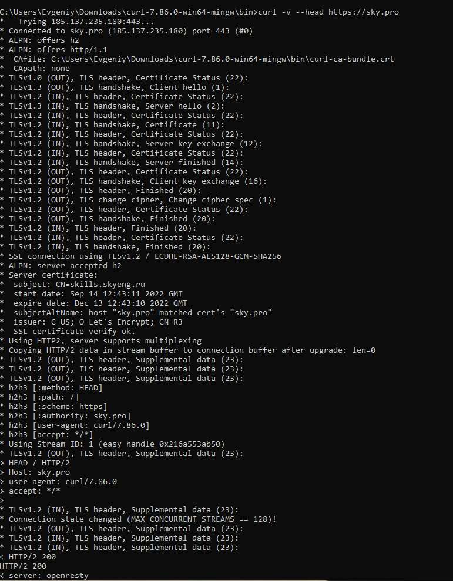
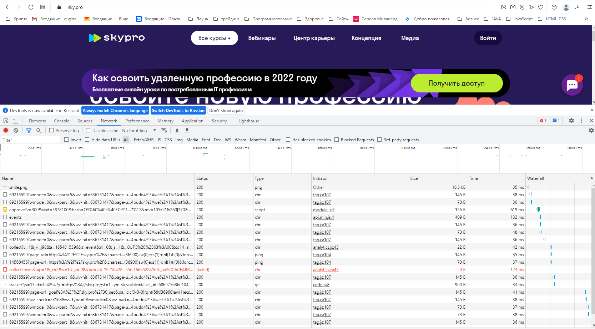
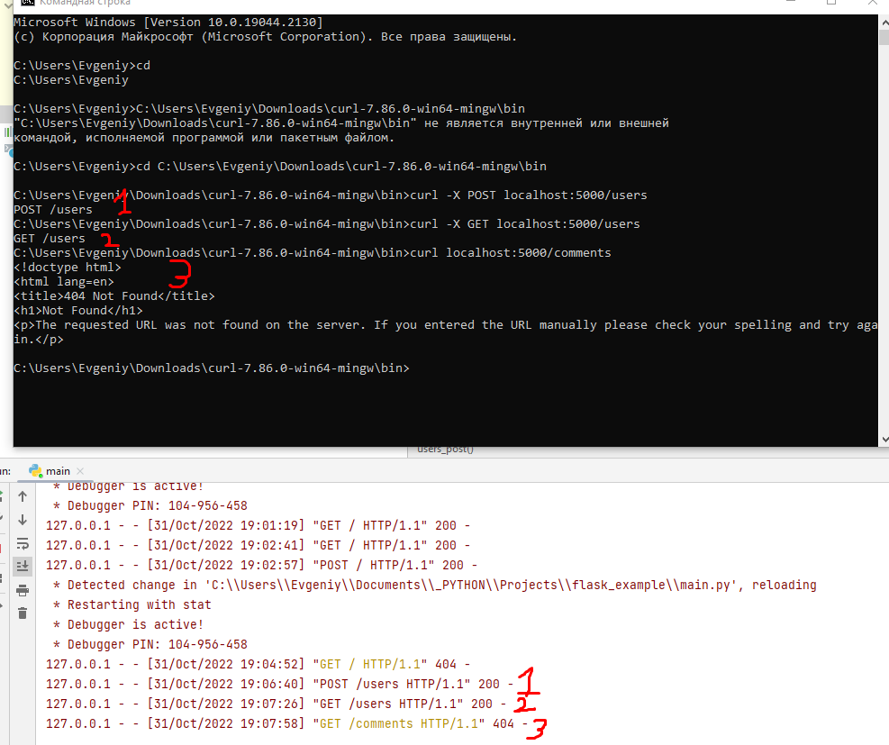
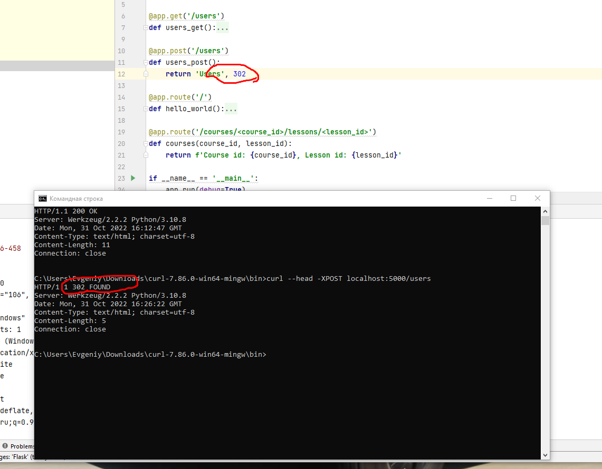
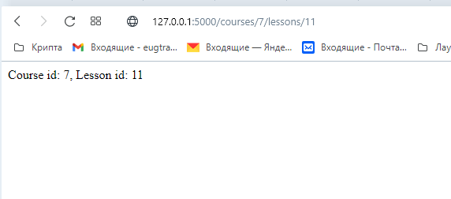

# Урок 1. Веб-архитектура с Flask. Домашнее задание
программирования на Python (ISA)

- [ ]  Скриншот командной строки с результатом выполнения команды curl --head https://sky.pro
- 

- [ ]  Скриншот браузера (раздел Network (Сеть))
- 

- 
- [ ]  запрос: curl -X POST,GET localhost:5000/users
- 

- 
 @app.post('/users')
def users():
    return 'Users', 302

- [ ] запрос: curl --head -XPOST localhost:8080/users  
- 

- 
- [ ]  Динамические маршруты
- 

https://github.com/GeeN33/flask_example.git

Откройте склонированный репозиторий в PyCharm.

### Cоздайте виртуальное окружение:

#### Простой вариант:
Pycharm может предложить вам сделать это после того, как вы откроете папку с проектом.
В этом случае после открытия папки с проектом в PyCharm
Появляется всплывающее окно, Creating virtuan envrironment c тремя полями.
В первом поле выбираем размещение папки с вирутальным окружением, как правило это папка venv
в корне проекта
Во втором поле выбираем устанавливаемый интерпритатор по умолчанию (можно оставить без изменений)
В 3 поле выбираем список зависимостей (должен быть выбран фаил requirements.txt, находящийся в корне папки проекта)

#### Если этого не произошло, тогда следует выполнить следующие действия вручную:
#### Установка виртуального окружения:
1. Во вкладке File выберите пункт Settings
2. В открывшемся окне, с левой стороны найдите вкладку с именем
вашего репозитория (Project: lesson23-and-tests)
3. В выбранной вкладке откройте настройку Python Interpreter
4. В открывшейся настройке кликните на значек ⚙ (шестеренки) 
расположенный сверху справа и выберите опцию Add
5. В открывшемся окне слева выберите Virtualenv Environment, 
а справа выберите New Environment и нажмите ОК

#### Установка зависимостей:
Для этого можно воспользоваться графическим интерфейсом PyCharm,
который вам предложит сделать это как только вы откроете файл с заданием.

Или же вы можете сделать это вручную, выполнив следующую команду в терминале:
`pip install -r requirements.txt`

#### Настройка виртуального окружения завершена!

